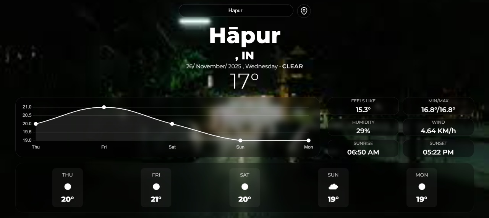

# 🌦️ Weather APP

A high-performance, single-screen weather station built with **Flask** and **Vanilla JavaScript**. 

This application features a "No-Scroll" dashboard layout that visualizes real-time weather data, temperature trends, air quality, and a 5-day forecast in a unified, glassmorphism interface.



## ✨ Key Features

* **⚡ Single-Screen Dashboard:** Responsive layout designed to fit perfectly on standard screens without scrolling.
* **📍 Geolocation Support:** "Locate Me" button to fetch weather data for your exact GPS coordinates.
* **📈 Interactive Temperature Graph:** Visualizes the temperature trend for the next 5 days using **Chart.js**.
* **🍃 Air Quality Index (AQI):** Real-time pollution monitoring with color-coded health indicators (Good to Hazardous).
* **🎨 Dynamic Themes:** Background automagically adapts to weather conditions (Clear Night, Rain, Clouds, etc.).
* **📅 5-Day Forecast:** Sleek bottom strip showing upcoming daily averages.
* **💧 Vital Stats:** Detailed grid showing Humidity, Wind Speed, "Feels Like" temp, Sunrise, and Sunset times.

## 🛠️ Tech Stack

* **Backend:** Python 3, Flask
* **Frontend:** HTML5, CSS3 (Flexbox/Grid), JavaScript (ES6+)
* **Data Visualization:** Chart.js
* **API:** OpenWeatherMap (Current Weather, Forecast, Air Pollution)
* **Design Style:** Glassmorphism / Dark Mode

## ⚙️ Installation & Setup

Follow these steps to run the project locally on your machine.

### 1. Clone the Repository
```bash
git clone [https://github.com/krissshnaverrrma/Weather-APP.git](https://github.com/krissshnaverrrma/Weather-APP.git)
cd weather-pro-dashboard
---